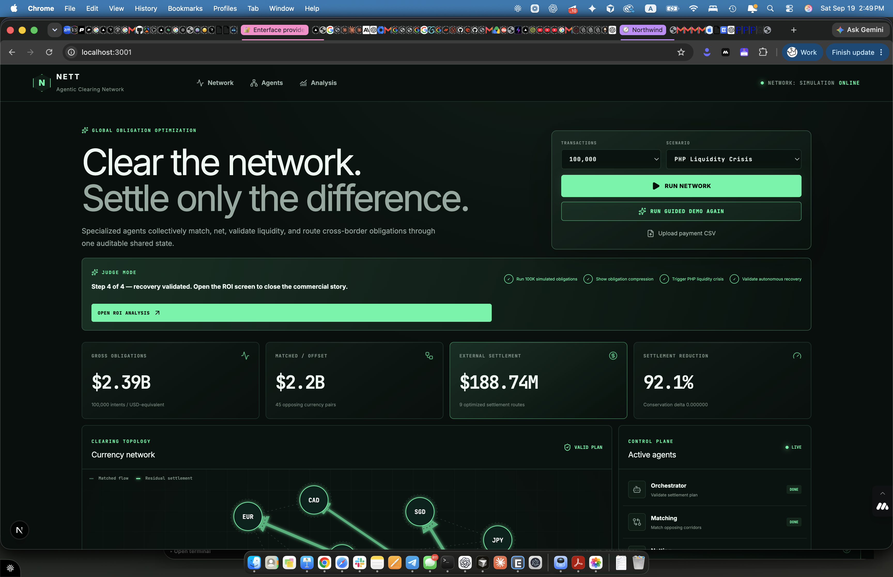
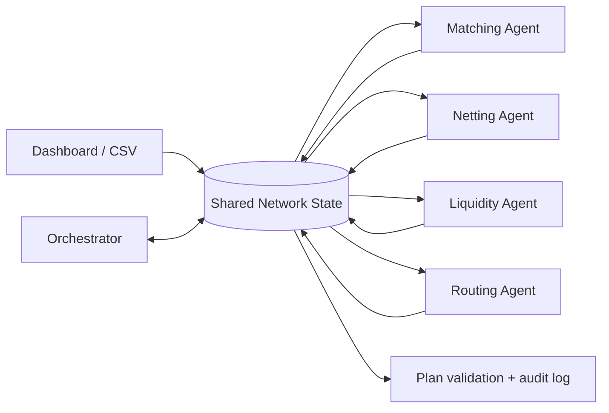
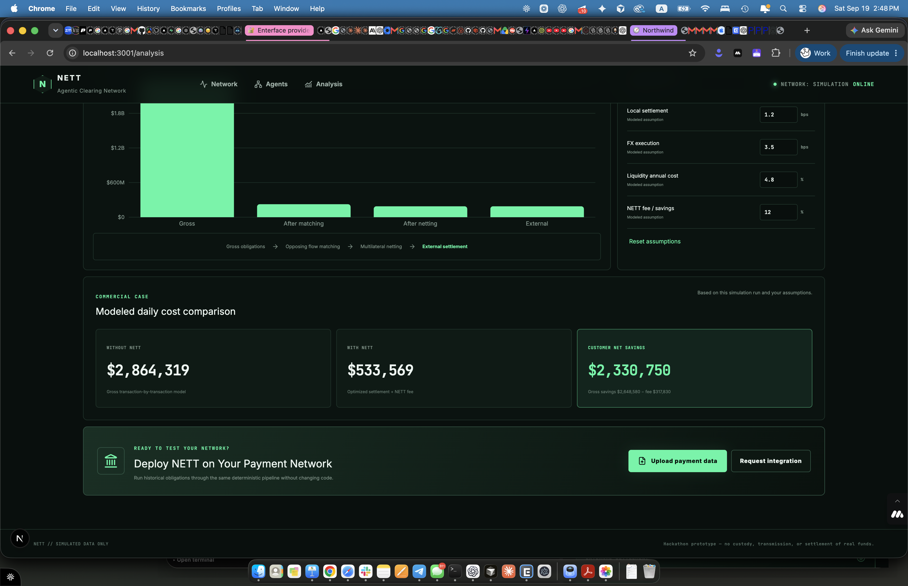

# NETT — Agentic Clearing for Global Payments

NETT is a deterministic multi-agent clearing simulation for high-volume cross-border payment networks. It asks one practical question: given everything that needs to be paid, what is the minimum external settlement required after reciprocal matching and multilateral netting—subject to liquidity, cost, time, capacity, and risk constraints?

> **Required disclaimer:** NETT is a hackathon prototype and simulation. It does not custody, transmit, or settle real funds. All bundled and generated data is explicitly simulated. Modeled economics are editable assumptions, not claimed market prices.



## Two-minute judge demo

1. Open the **Network** dashboard and click **Guided 2-Min Demo**.
2. Watch Judge Mode run 100,000 simulated obligations, expose the calculated compression, trigger the PHP liquidity crisis, and validate autonomous recovery.
3. Point to the measured settlement reduction, valid plan, active-agent status, recovery timing, and expandable **WHY?** audit decisions.
4. Click **Open ROI Analysis** to connect the clearing result to editable modeled economics and customer net savings.

The walkthrough is deterministic and requires no API key, account, or external service. See [demo-script.md](docs/demo-script.md) for the exact presenter narration.

## Run locally

```bash
npm install && npm run dev
```

Open [http://localhost:3000](http://localhost:3000) and select **Guided 2-Min Demo**. The manual controls remain available for individual scenarios and CSV uploads.

```bash
npm test       # deterministic engine tests
npm run lint   # Next.js + TypeScript lint
npm run build  # production build
```

No API key is required. `.env.example` documents the optional future LLM integration point; the demo always uses its deterministic orchestrator fallback.

## Tech stack

| Layer | Technology | Purpose in NETT |
| --- | --- | --- |
| Application | Next.js 15, React 19, TypeScript | App Router UI, typed simulation code, and local demo server |
| Styling | Tailwind CSS | Responsive financial-infrastructure interface |
| Shared agent state | Zustand | One inspectable network state read and written by every specialized agent |
| Data visualization | Recharts | Economics waterfall and modeled cost comparison |
| UI icons | Lucide React | Accessible interface icons |
| Clearing engine | Deterministic TypeScript | Seeded generation, matching, multilateral netting, liquidity checks, and constrained routing |
| Quality | Vitest, ESLint | Engine tests and static code-quality checks |

The application uses seeded simulated data and runs entirely locally for a reliable, reproducible demo.

## Why NETT

Cross-border systems commonly optimize one payment at a time. That hides reciprocal and multilateral offsets across the network, needlessly consuming external settlement liquidity. NETT analyzes the obligation graph as a whole, removes offsetting volume, calculates conserved net currency positions, and routes only the remaining differences.

The target customer is a cross-border processor, remittance company, marketplace, payroll platform, fintech, or financial institution with enough multi-currency volume to create recurring opposing flows. The buying moment is concrete: upload historical obligations, observe calculated compression, model cost assumptions, and compare the customer result before integration.

## Architecture and shared memory



Every agent reads and writes the same Zustand-backed `NetworkState`. The `/agents` page exposes payment counts, matches, net positions, liquidity alerts, routes, market events, and the full decision count. Monetary calculations remain deterministic TypeScript; the orchestrator controls sequencing and explanations.

| Agent | Deterministic responsibility | Shared-state output |
| --- | --- | --- |
| Orchestrator | Observe → choose tool → reread → validate | execution sequence, decisions |
| Matching | Aggregate and offset reciprocal corridors | matches, directed residuals |
| Netting | Collapse residuals into currency positions | conserved positions, demands |
| Liquidity | Protect pool reserve floors | reservations, shortfalls |
| Routing | Weighted graph optimization | valid rail paths, cost, time, risk |

See [architecture.md](docs/architecture.md) and [agents.md](docs/agents.md) for implementation detail.

## Clearing and netting algorithm

Amounts are simulated USD-equivalent reporting values, allowing conservation checks across currencies without pretending to provide live FX conversion.

1. Aggregate obligations by directed currency corridor.
2. For each unordered currency pair, offset `min(A→B, B→A)` on both sides.
3. Convert corridor residuals into signed currency positions (`outgoing − incoming`).
4. Assert that all signed positions sum to zero within one cent.
5. Greedily pair positive and negative positions to create the minimum currency-level settlement demand set.
6. Route each demand over available simulated rails using deterministic weighted shortest-path selection and enforce liquidity, reserve floor, capacity, availability, cost, time, and risk constraints.
7. Validate routed value against external settlement required.

The required sanity case is tested: USD→PHP $1,000 opposed by PHP→USD $800 yields $1,600 of gross offset volume and a $200 residual.

## Demo scenarios

- Seeded 10K, 50K, 100K, and 250K simulated obligation presets (100K default).
- PHP Liquidity Crisis (default): standard PHP liquidity is reduced; autonomous reoptimization selects qualifying liquidity-saving capacity.
- USD→PHP Rail Failure: the standard corridor is marked unavailable.
- FX Cost Spike: modeled execution cost is multiplied before route scoring.
- Institution Capacity Failure: standard-rail corridor capacities are reduced.
- CSV upload: `data/sample-payments.csv` runs through the identical clearing pipeline.

The interface measures generation, matching, netting, liquidity checks, routing, total engine time, and shock recovery time at runtime—none are hard-coded benchmark claims.

## Synthetic data and provenance

All payment intents, institutions, currency pools, settlement rails, market conditions, and economics inputs in NETT are simulated for this hackathon prototype. The synthetic generator is seeded so preset runs are reproducible. Currency and rail assumptions are bundled in `data/`, and `data/sample-payments.csv` is a representative, fictional CSV following the documented upload schema. NETT does not use customer data, personal data, live financial data, or real banking connections.

## Commercial model

The `/analysis` page compares **Without NETT** and **With NETT** using editable assumptions for traditional settlement cost, local settlement cost, FX cost, annual liquidity cost, and a NETT performance fee. It calculates gross modeled savings, the fee, and customer net savings from the active simulation run. A plausible commercial model is a platform subscription plus a small fee tied to verified modeled savings; all values shown in the demo remain assumptions.



See [economics.md](docs/economics.md) for formulas and guardrails, and [demo-script.md](docs/demo-script.md) for the 2–3 minute walkthrough.

## Limitations

- Simulation only: no real funds, bank integrations, KYC/AML, custody, payment initiation, or production settlement.
- USD-equivalent reporting values are used to make conservation auditable; this is not an FX pricing engine.
- Rail attributes, liquidity pools, institution names, and economics are modeled inputs.
- State is intentionally in-memory; reloading clears the active run.
- The CSV parser supports the documented schema and conventional quoted fields, not every dialect.
- The routing score is a transparent hackathon objective, not a regulated production risk policy.

## Repository map

- `app/` — App Router pages and simulation endpoint
- `components/` — dashboard, chart, agent, transaction, and UI components
- `lib/clearing/` — matching and multilateral netting
- `lib/liquidity/` — checks, reservations, release, and shortfall detection
- `lib/routing/` — simulated rails and constrained optimizer
- `lib/agents/` — orchestrator and shared network store
- `data/` — supported currencies, rail assumptions, scenarios, and sample CSV
- `tests/` — matching, conservation/netting, liquidity, routing, and shock recovery

## License

MIT
